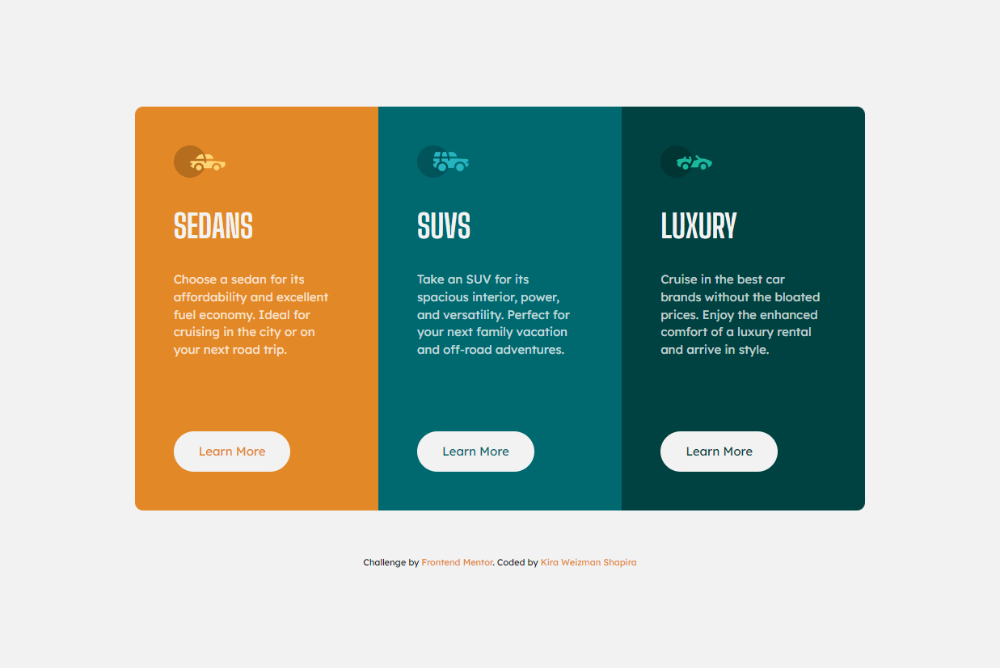

# Frontend Mentor - 3-column preview card component

### Welcome! 👋

Thanks for checking my second solution code to the [3-column preview card component challenge on Frontend Mentor](https://www.frontendmentor.io/challenges/3column-preview-card-component-pH92eAR2-).

In this solution I used the mobile approach first.
What I learned:
1. Coding using a mobile first approach is really different than using a desktop first approach.
I'm not sure how significant that is, but certainly this an interesting approach to follow.

2. In this solution following a YouTube video [here](https://www.youtube.com/watch?v=PM3XW_1RAIs&list=PL4cUxeGkcC9hH1tAjyUPZPjbj-7s200a4), I was inspired to design according to designers approach with the grid of 12 columns. It was a very interesting experiment to try, and later I want to check if this approach is effective in coding other designs based on it.

### Built with

- Semantic HTML5 markup
- CSS custom properties
- CSS Grid
- Mobile-first workflow

## Author

Coded by <a href="https://www.frontendmentor.io/profile/kirawesh">@kirawesh</a>